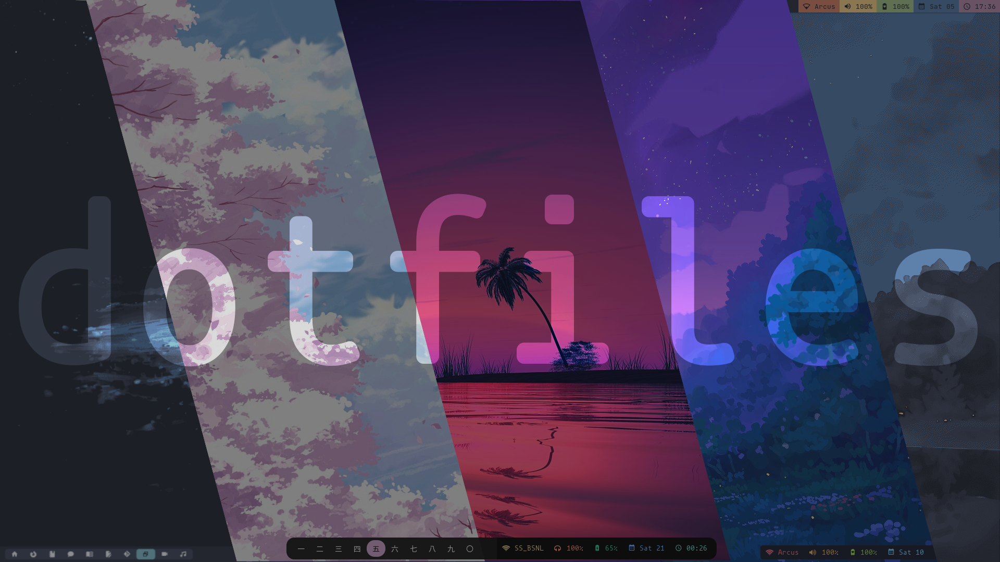
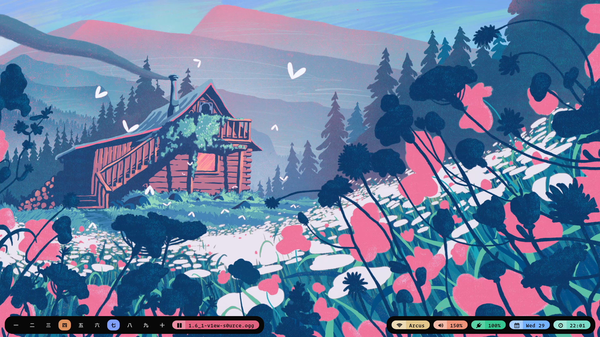
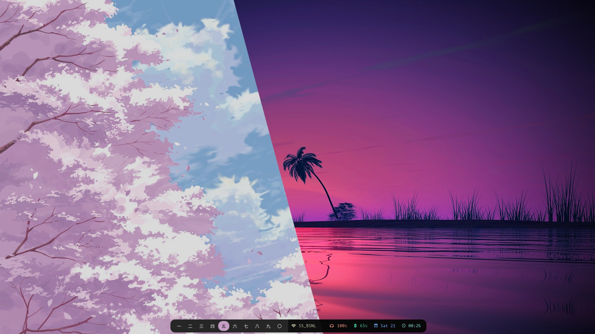
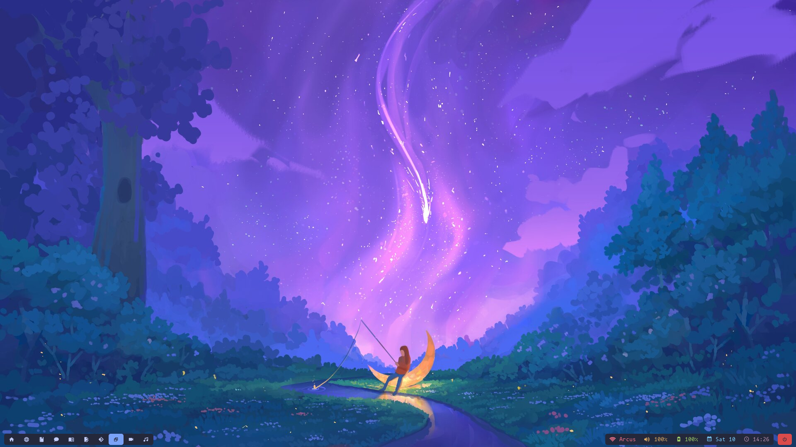
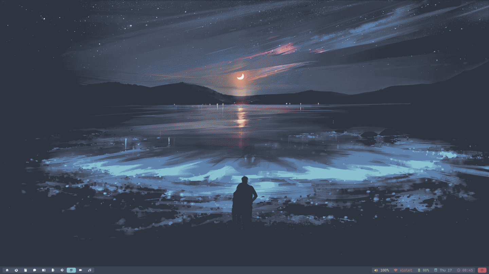
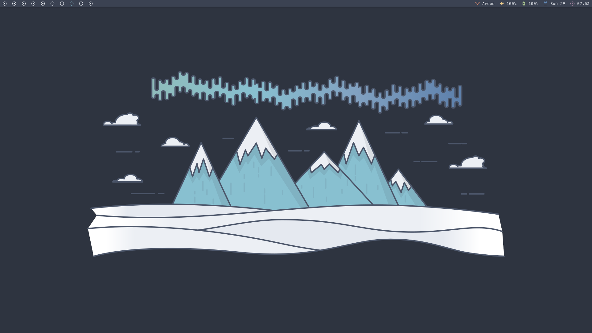
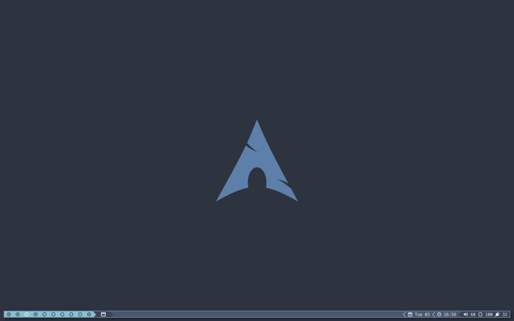

	<h1 align="center">Welcome ~</h1>

Welcome to my dotfiles repo. Below you'll find a list of all the setups I've used so far along with links to details regarding each of them. That is where I've listed all the components involved in creating the setup along with other items such as wallpapers, fonts and icons. You'll also find my config files for each setup in their respective folders. I've tried to be as exhaustive as possible with the details but in case you have any doubts or suggestions, feel free to open an issue and I'll get back to you as soon as I can. Thanks for reading and I hope you enjoy your stay at my ~.

---
<body>
	<h2 align="center">
		<a href="https://github.com/lokesh-krishna/dotfiles/tree/main/moonfly">Cotton Candy Factory</a>
	</h2>
</body>

<body>
	<h2 align="center">
		<a href="https://github.com/lokesh-krishna/dotfiles/tree/main/mountain">Sakura/Neon Sunrise</a>
	</h2>
</body>

<body>
	<h2 align="center">
		<a href="https://github.com/lokesh-krishna/dotfiles/tree/main/tokyo-night">Fishing for Stars</a>
	</h2>
</body>

<body>
	<h2 align="center">
		<a href="https://github.com/lokesh-krishna/dotfiles/tree/main/nord-v3">All I Want</a>
	</h2>
</body>

<body>
	<h2 align="center">
		<a href="https://github.com/lokesh-krishna/dotfiles/tree/main/nord-v2">Solitude</a>
	</h2>
</body>

<body>
	<h2 align="center">
		<a href="https://github.com/lokesh-krishna/dotfiles/tree/main/nord-v1">The Nord Desktop</a>
	</h2>
</body>

