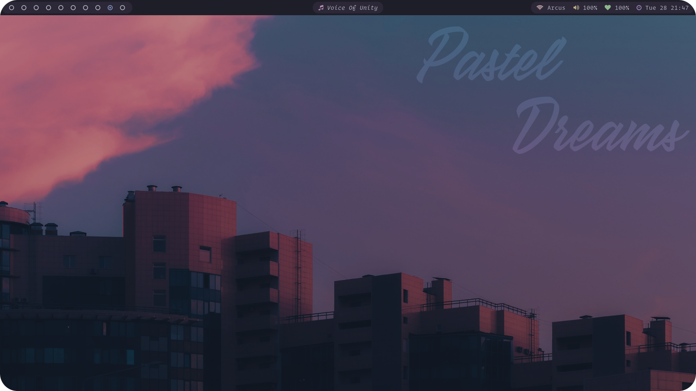

Pastel Dreams, a rice inspired by the vibrant [Catppuccin](https://github.com/catppuccin/catppuccin) color scheme. 

The following are the UI components of this setup:
- window manager: [sway](https://swaywm.org/)
- statusbar: [waybar](https://github.com/Alexays/Waybar)
- application launcher: [bemenu](https://github.com/Cloudef/bemenu)
- notification daemon: [mako](https://github.com/emersion/mako)
- lock screen: [swaylock-effects](https://github.com/mortie/swaylock-effects)

The following are the programs used in this setup:
- terminal: [kitty](https://sw.kovidgoyal.net/kitty/)
- editor: [neovim](https://neovim.io/)
- browsers
	- web: [qutebrowser](https://qutebrowser.org/)
	- gemini: [amfora](https://github.com/makeworld-the-better-one/amfora)
- email client: [neomutt](https://neomutt.org/)
- irc client: [catgirl](https://git.causal.agency/catgirl/about/)
- document viewer: [zathura](https://pwmt.org/projects/zathura/)
- music
	- music player: [spotify](https://www.spotify.com/us/) with [Spicetify](https://spicetify.app/)
	- visualiser: [cava](https://github.com/ncmpcpp/ncmpcpp)
- system monitor: [btop](https://github.com/aristocratos/btop)
- image viewer: [imv](https://github.com/eXeC64/imv)
- media player: [mpv](https://mpv.io/)
- file manager: [nnn](https://github.com/jarun/nnn)
- calendar: [khal](https://github.com/pimutils/khal)
- to-dos: [todoman](https://github.com/pimutils/todoman)

Wallpapers used in this setup can be found in the [wallpapers](https://github.com/lokesh-krishna/dotfiles/tree/main/catppuccin/wallpapers) directory.

The typefaces used in this setup are:
- terminal/monospace: [operator mono](https://www.typography.com/fonts/operator/overview/), patched using [nerd fonts](https://github.com/ryanoasis/nerd-fonts/)
- ui/proportional/sans-serif: [inter](https://rsms.me/inter/)
- serif: [piazolla](https://piazzolla.huertatipografica.com/)
- lockscreen: [calvin and hobbes](https://www.dafont.com/calvin-and-hobbes.font)

### Screenshots

#### clean
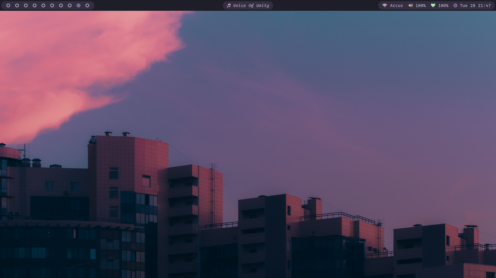

#### fetch
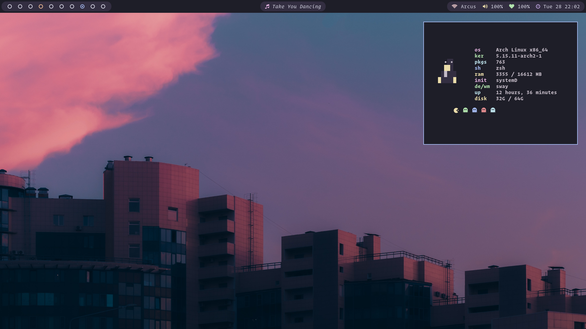

#### busy
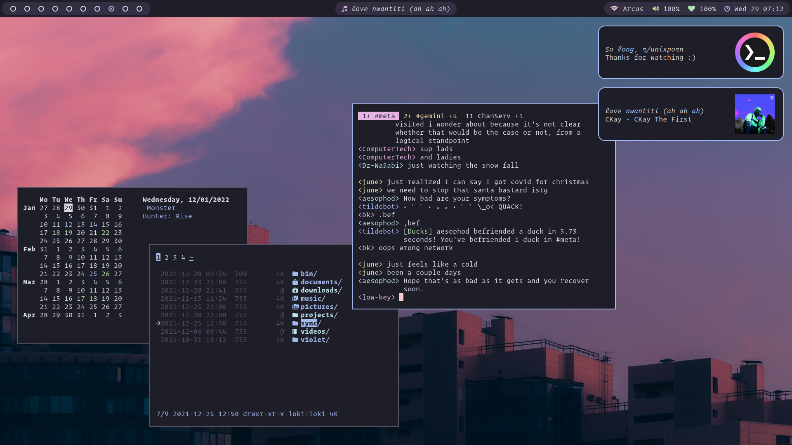

#### browsers
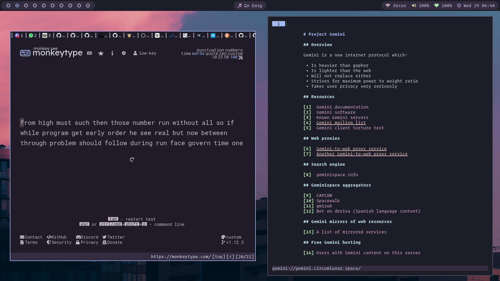

#### neovim
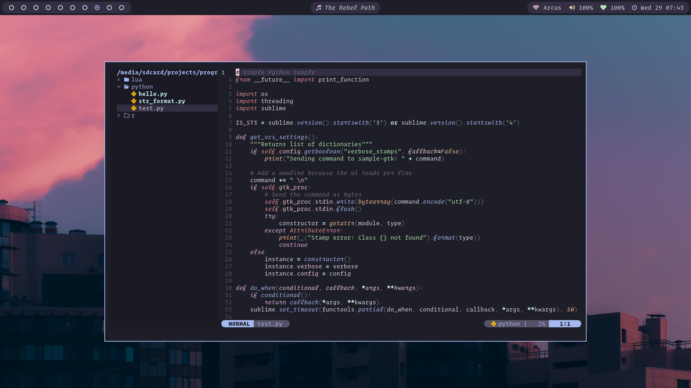

#### zathura
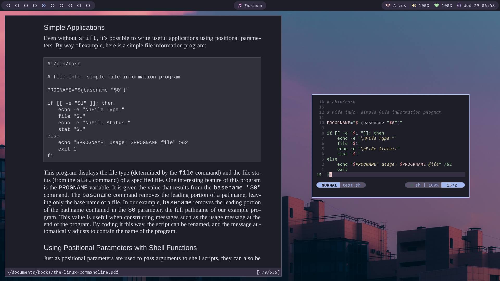

#### communications central
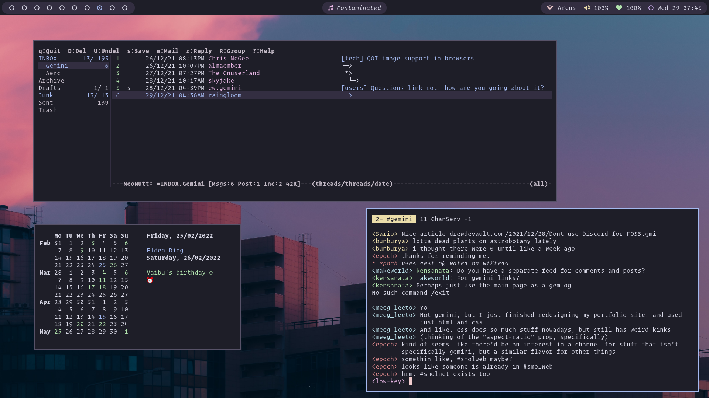

#### music
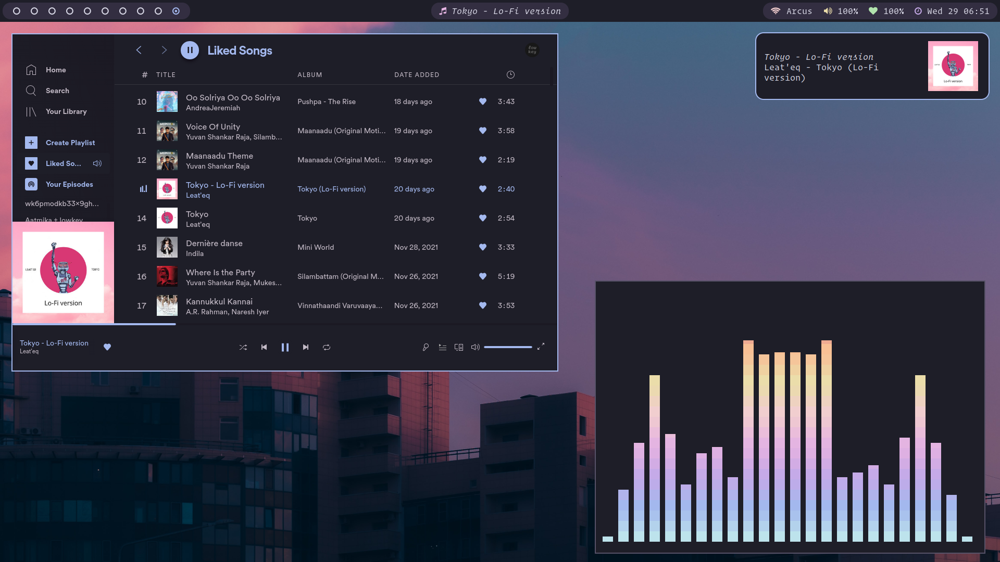

#### bemenu (application launcher)
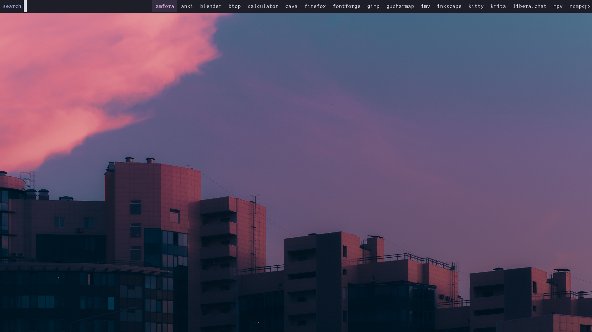

#### mako (notifications)
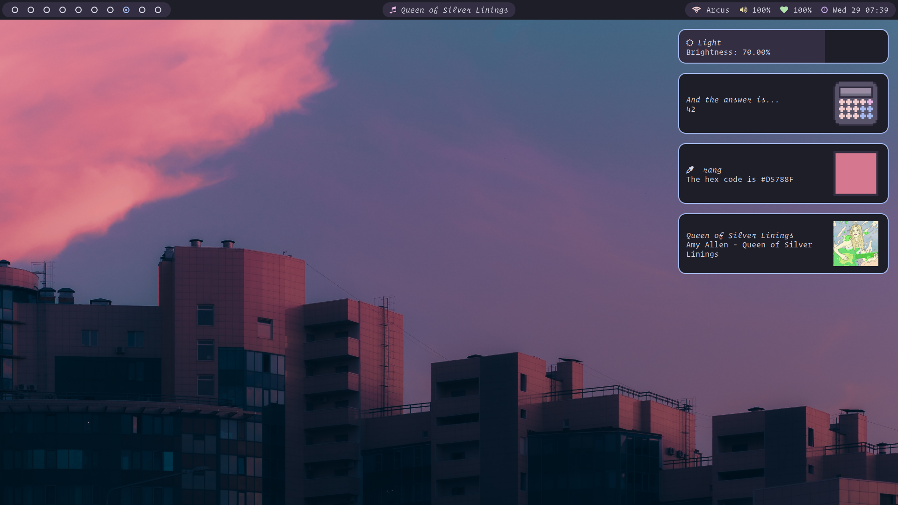

#### lockscreen
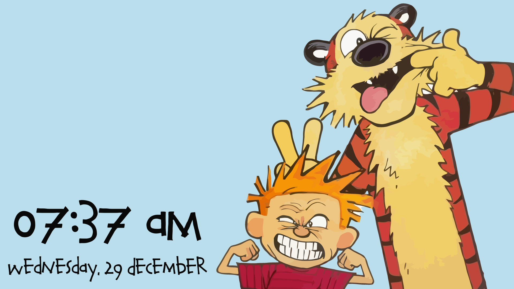
