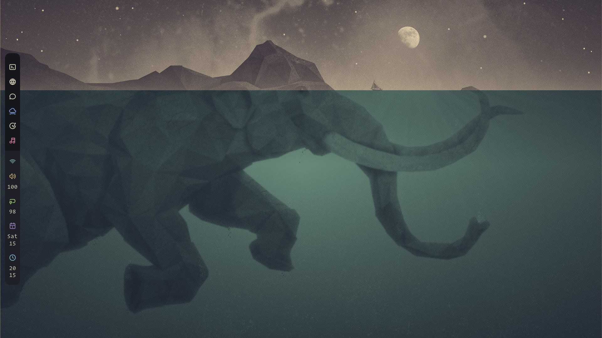
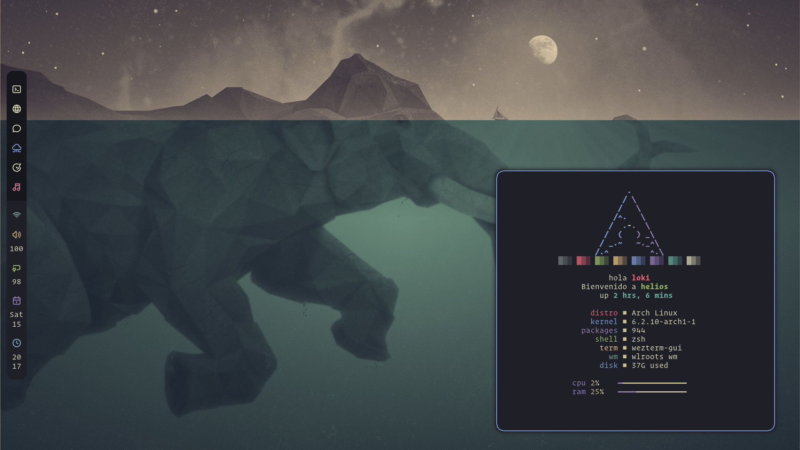
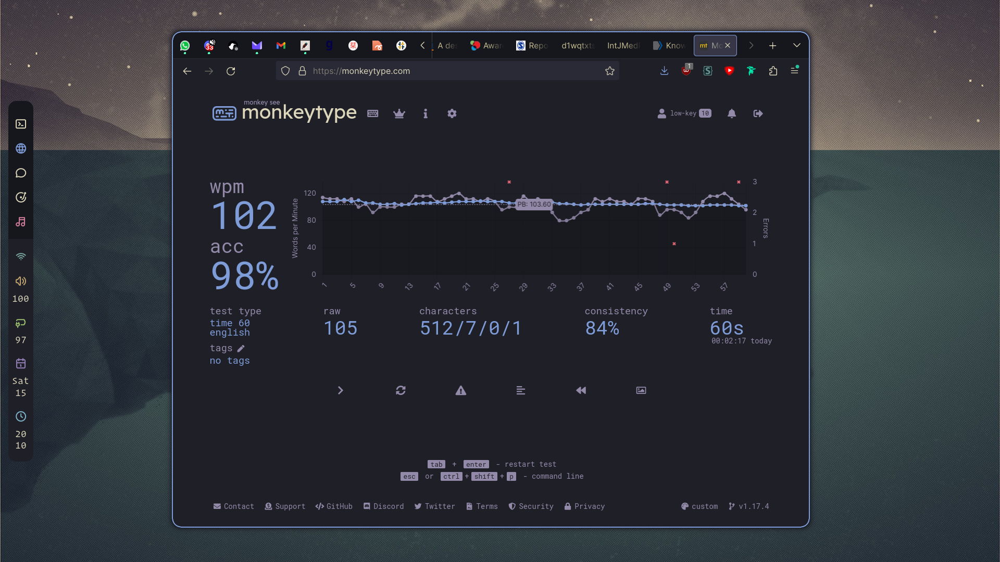
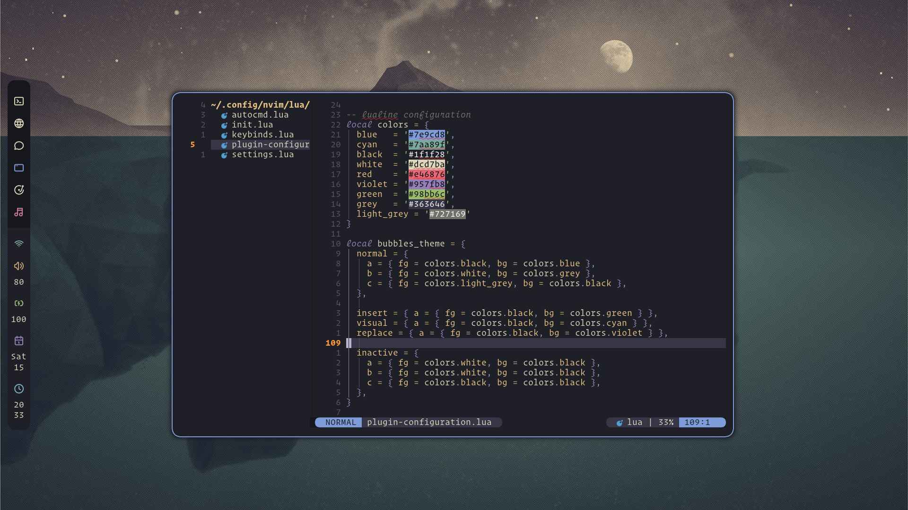
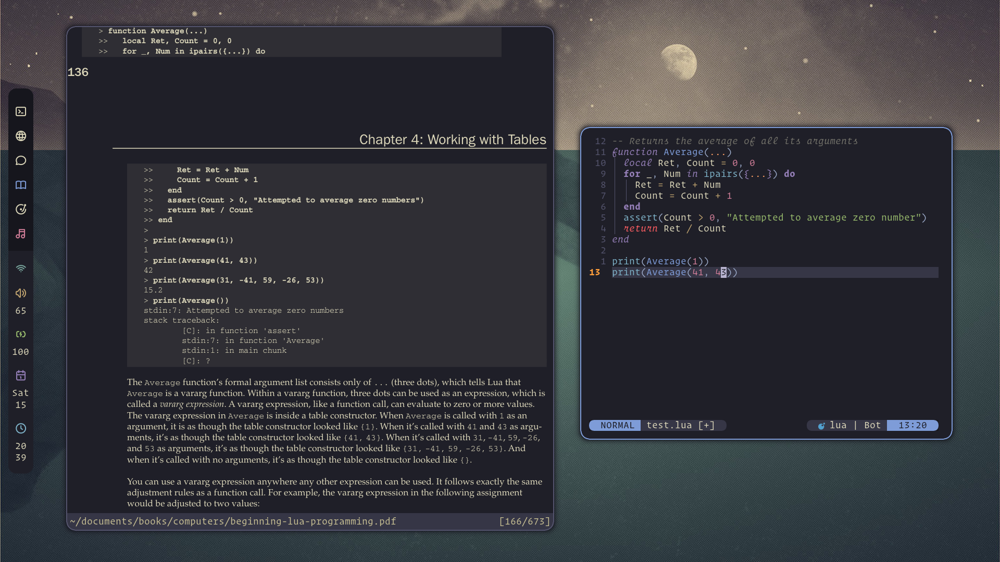
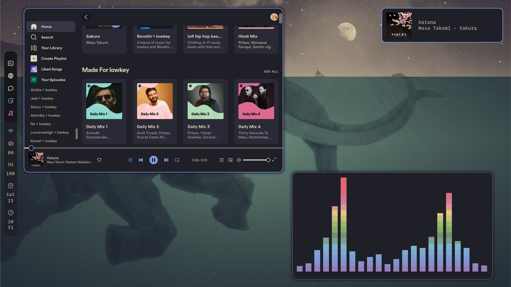
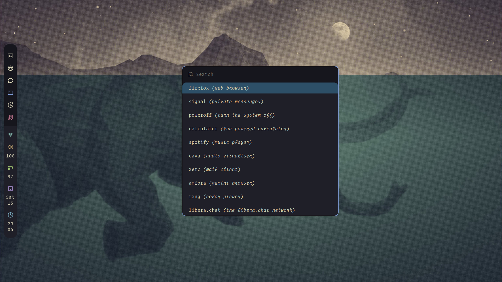
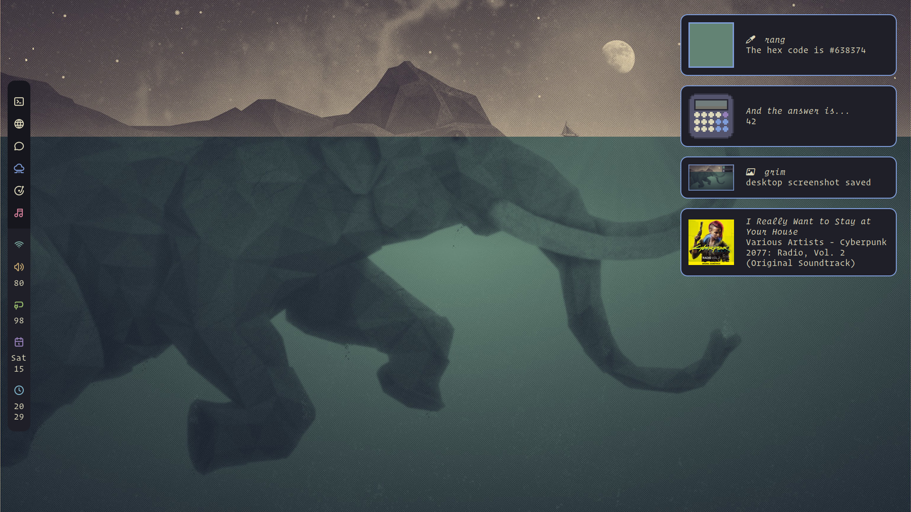
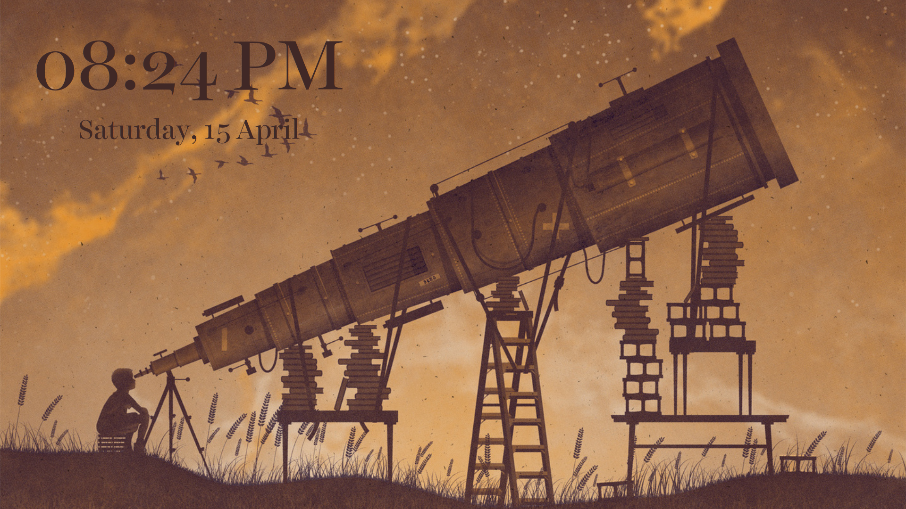

Beneath the Surface, a rice inspired by the gorgeous [Kanagawa](https://github.com/catppuccin/catppuccin) color scheme, which in turn was inspired by [_The Great Wave of Kanagawa_](https://en.wikipedia.org/wiki/The_Great_Wave_off_Kanagawa).

The following are the UI components of this setup:
- window manager: [hyprland](https://hyprland.org/)
- statusbar: [waybar](https://github.com/Alexays/Waybar)
- application launcher: [rofi (fork for wayland)](https://github.com/lbonn/rofi#wayland-support)
- notification daemon: [dunst](https://dunst-project.org/)
- lock screen: [swaylock-effects](https://github.com/mortie/swaylock-effects)

The following are the programs used in this setup:
- terminal: [wezterm](https://wezfurlong.org/wezterm/)
- editor: [neovim](https://neovim.io/)
- web browser : [firefox](https://www.mozilla.org/en-US/firefox/new/)
- email client: [aerc](https://git.sr.ht/~rjarry/aerc)
- irc client: [catgirl](https://git.causal.agency/catgirl/about/)
- document viewer: [zathura](https://pwmt.org/projects/zathura/)
- music
	- music player: [spotify](https://www.spotify.com/us/) with [Spicetify](https://spicetify.app/)
	- visualiser: [cava](https://github.com/ncmpcpp/ncmpcpp)
- system monitor: [btop](https://github.com/aristocratos/btop)
- image viewer: [imv](https://github.com/eXeC64/imv)
- media player: [mpv](https://mpv.io/)
- file manager: [nnn](https://github.com/jarun/nnn)
- calendar: [khal](https://github.com/pimutils/khal)
- to-dos: [todoman](https://github.com/pimutils/todoman)

Wallpapers used in this setup can be found in the [wallpapers](https://github.com/lokesh-krishna/dotfiles/tree/main/kanagawa/wallpapers) directory.

The typefaces used in this setup are:
- terminal/monospace: [operator mono](https://www.typography.com/fonts/operator/overview/)
- ui/proportional/sans-serif: [inter](https://rsms.me/inter/)
- serif: [portada](https://fonts.adobe.com/fonts/portada#about-section)
- lockscreen: [harriet display](https://okaytype.com/typefaces/harriet)

### Screenshots

#### clean

#### fetch

#### busy

#### browser

#### neovim

#### zathura

#### music

#### rofi (application launcher)

#### dunst (notifications)

#### lockscreen

