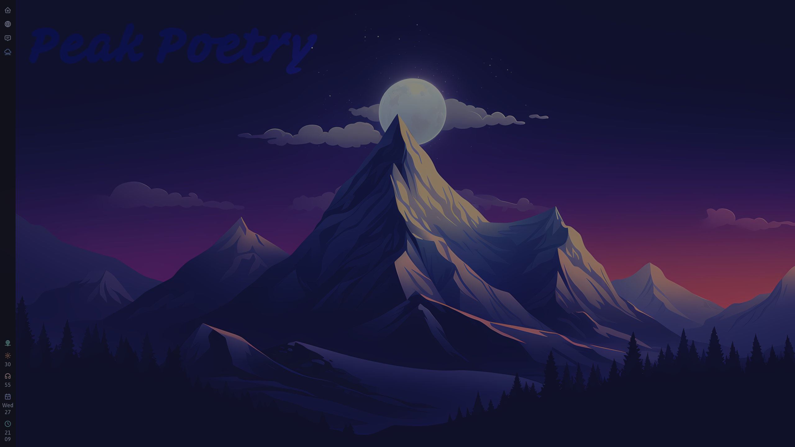
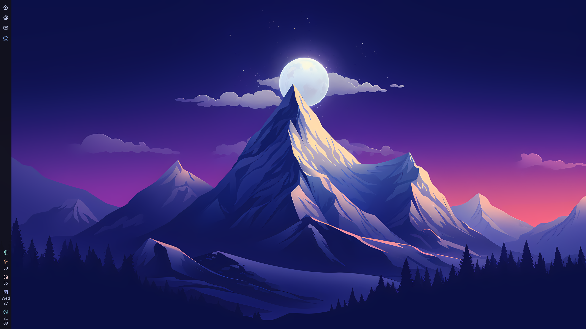
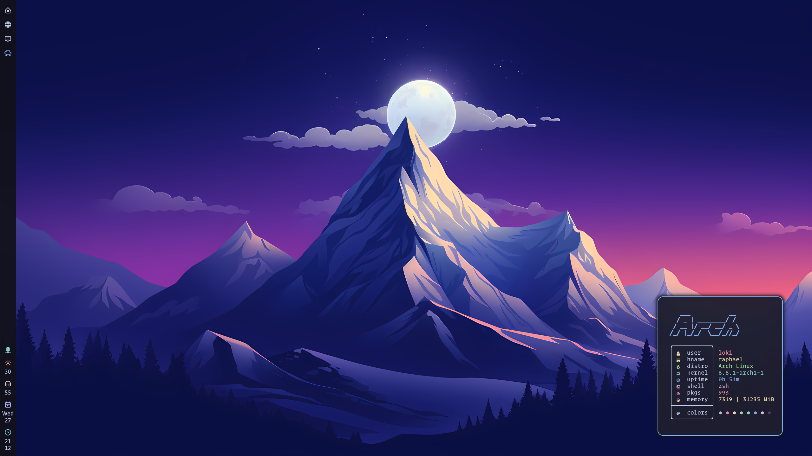
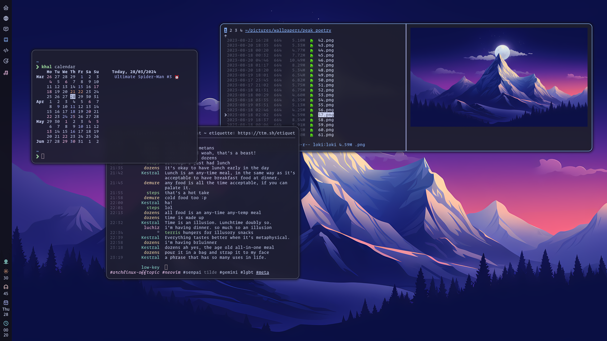
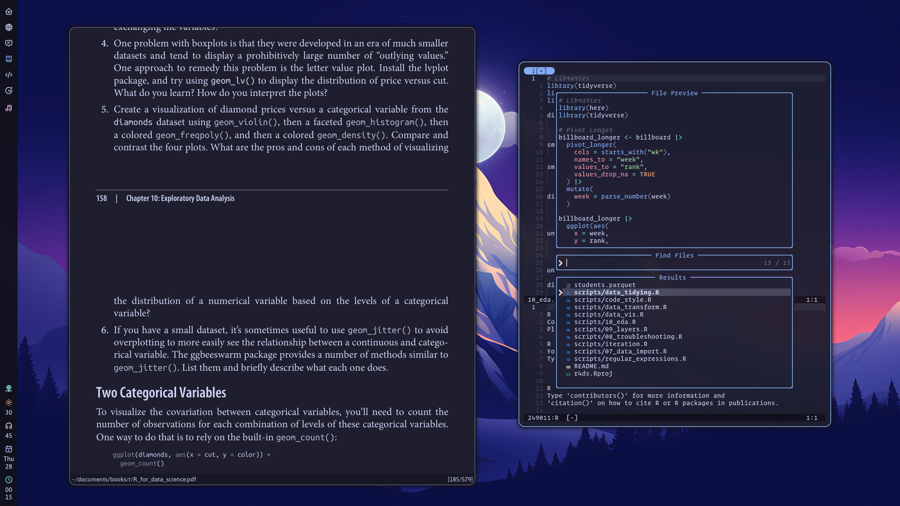
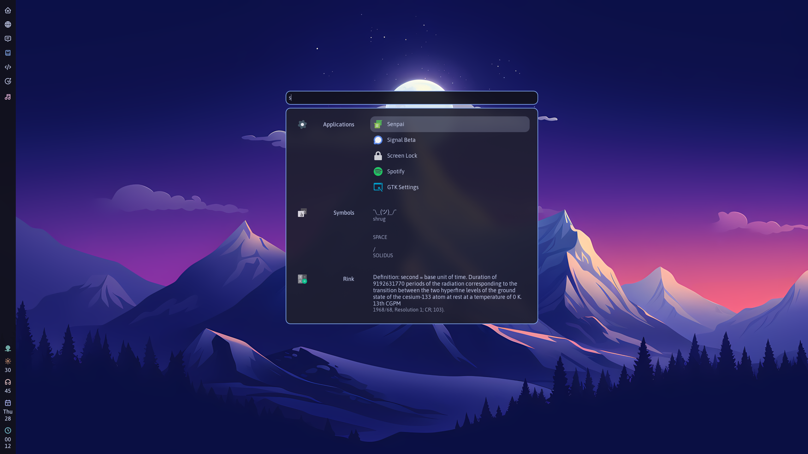
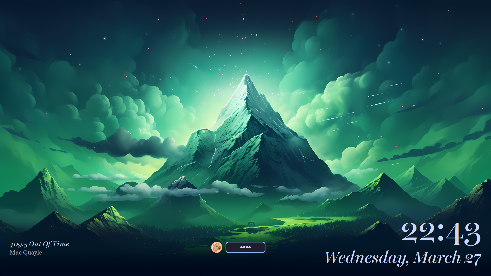

Peak Poetry, a rice inspired by a multitude of incredible projects, coming together to give me the best Linux desktop experience I've ever enjoyed.  
Credits go to  
* the pleasing and soothing [Catppuccin](https://github.com/catppuccin/catppuccin) color scheme
* the incredible [Hyprland](https://hyprland.org) ecosystem
* the excellent [kickstart.nvim](https://github.com/nvim-lua/kickstart.nvim)
* the gorgeous [Peak Poetry](https://backdrops.gumroad.com/l/peakpoetry) wallpaper collection by [Backdrops](https://www.backdrops.io/)

The following are the UI components of this setup:
- window manager: [hyprland](https://hyprland.org/)
- statusbar: [waybar](https://github.com/Alexays/Waybar)
- application launcher: [anyrun](https://github.com/Kirottu/anyrun/)
- notification daemon: [dunst](https://dunst-project.org/)
- lock screen: [hyprlock](https://github.com/hyprwm/hyprlock)

The following are the programs used in this setup:
- terminal: [kitty](https://sw.kovidgoyal.net/kitty/)
- editor: [neovim](https://neovim.io/), setup inspired by the excellent [kickstart.nvim](https://github.com/nvim-lua/kickstart.nvim)
- web browser : [firefox](https://www.mozilla.org/en-US/firefox/new/)
- email client: [aerc](https://git.sr.ht/~rjarry/aerc)
- irc client: [senpai](https://git.sr.ht/~delthas/senpai/)
- document viewer: [zathura](https://pwmt.org/projects/zathura/)
- music
	- music player: [spotify](https://www.spotify.com/us/) with [Spicetify](https://spicetify.app/)
	- visualiser: [cava](https://github.com/ncmpcpp/ncmpcpp)
- system monitor: [btop](https://github.com/aristocratos/btop)
- image viewer: [imv](https://github.com/eXeC64/imv)
- media player: [mpv](https://mpv.io/)
- file manager: [nnn](https://github.com/jarun/nnn)
- calendar: [khal](https://github.com/pimutils/khal)
- to-dos: [todoman](https://github.com/pimutils/todoman)

Wallpapers used in this setup can be found in the [wallpapers](https://github.com/lokesh-krishna/dotfiles/tree/main/peak_poetry/wallpapers) directory.

The typefaces used in this setup are:
- terminal/monospace: [operator mono](https://www.typography.com/fonts/operator/overview/)
- ui/proportional/sans-serif: [asap](https://github.com/Omnibus-Type/Asap)
- serif: [william](https://www.typotheque.com/fonts/william-text)
- lockscreen: [harriet display](https://okaytype.com/typefaces/harriet)

### Screenshots

#### clean

#### fetch

#### busy

#### browser

#### zathura

#### music

#### anyrun (application launcher)

#### lockscreen

