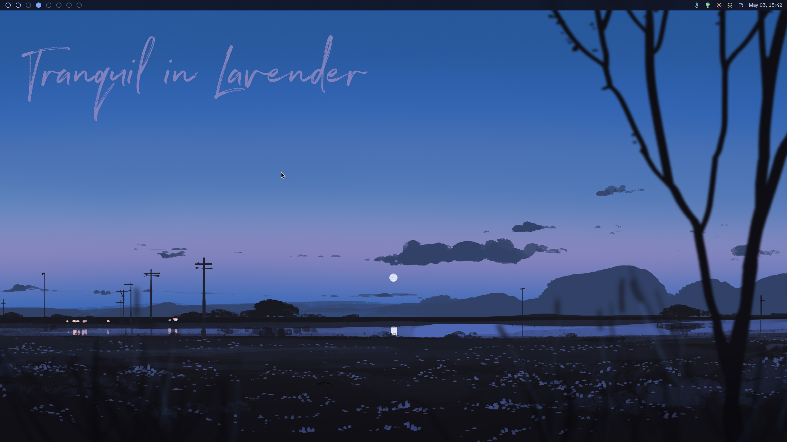
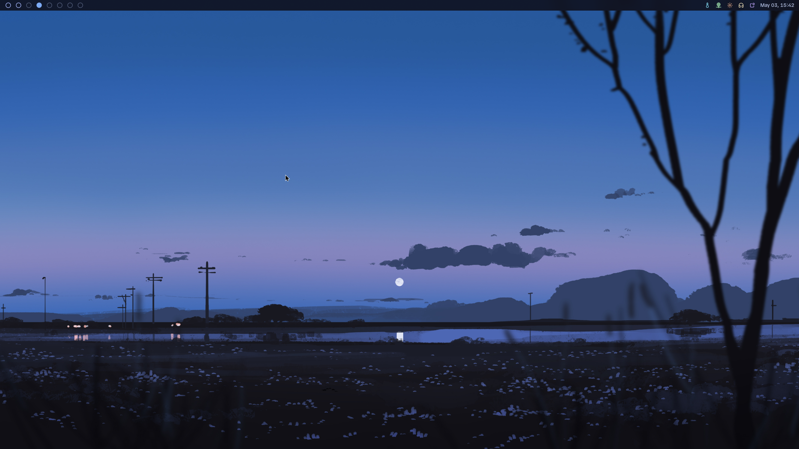
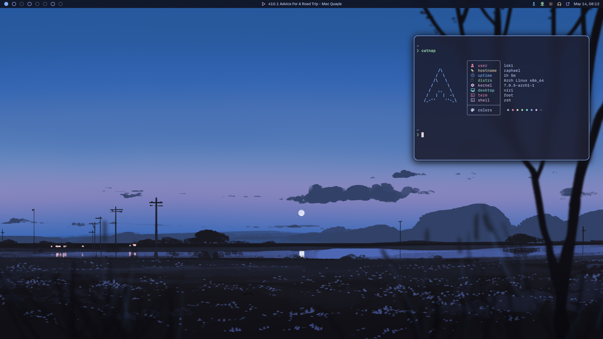
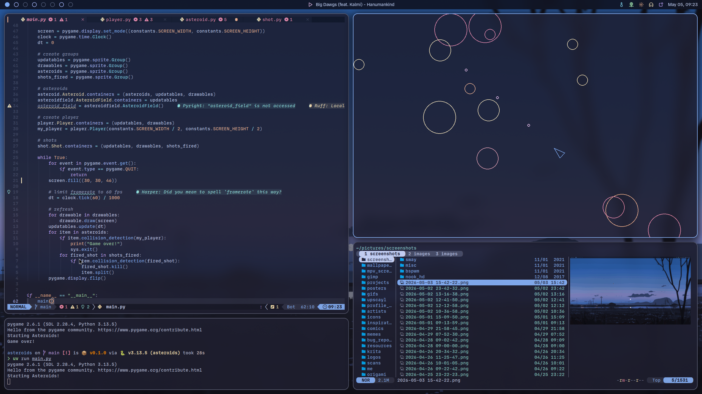
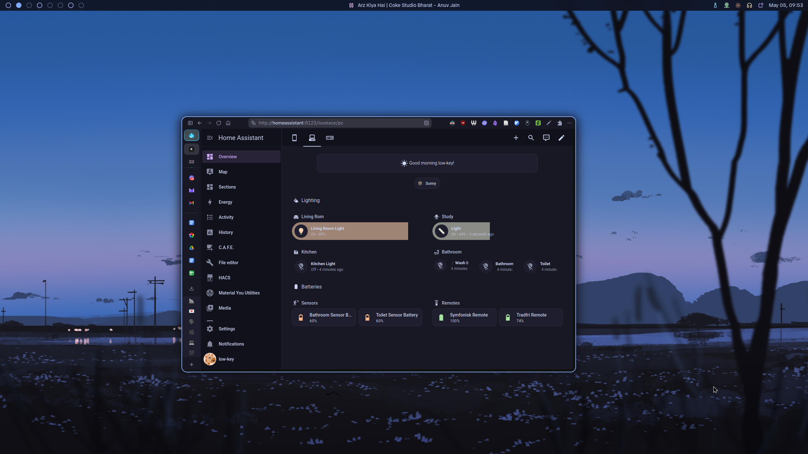
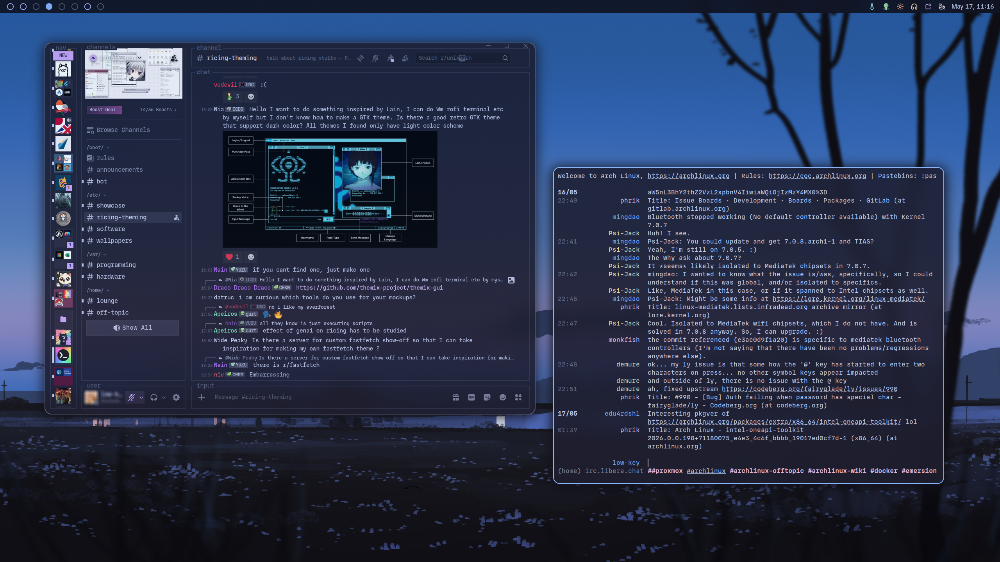
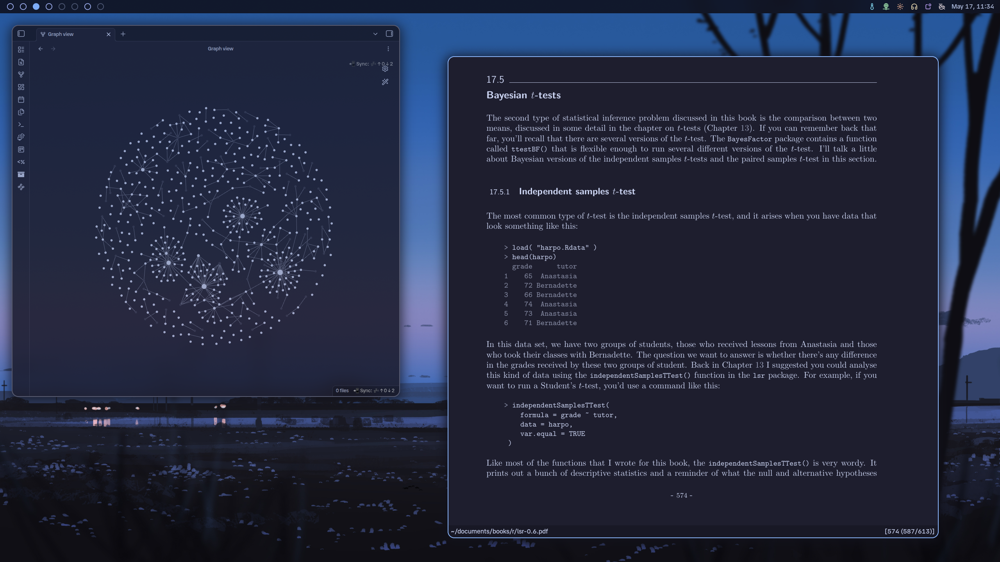
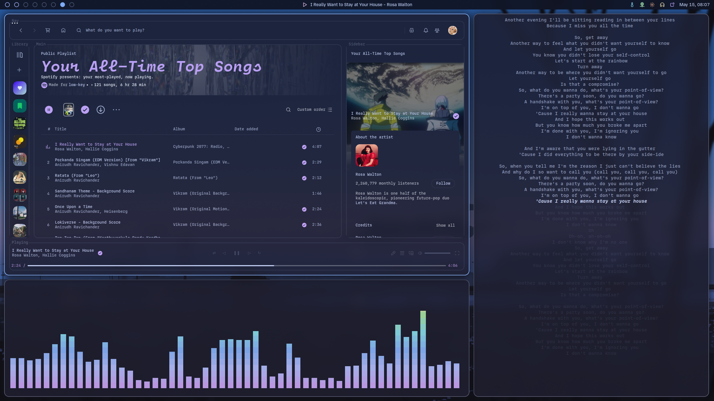
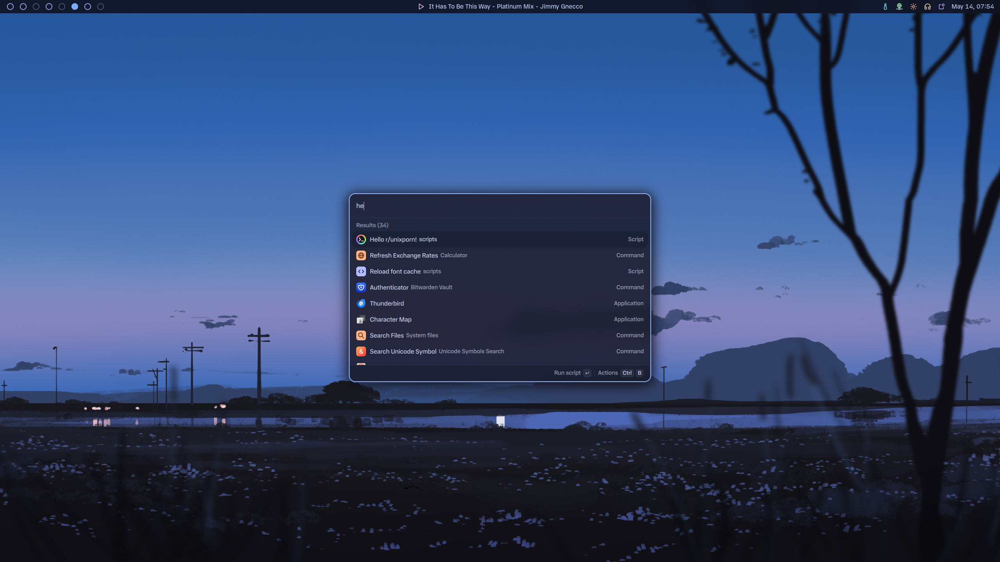
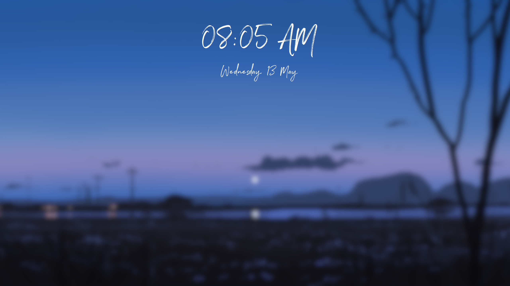

*Tranquil in Lavender*, my current setup (May, 2026), built atop an excellent stack of programs that I'm proud to present.

Credits go to  

* the comforting (and deeply familiar) [Catppuccin](https://github.com/catppuccin/catppuccin) color scheme
* the paradigm-shifting [Niri](https://niri-wm.github.io/niri/). You can't go back from scrollable tiling.
* the simple yet powerful [LazyVim](https://lazyvim.org) setup for Neovim
* the soothing artwork by [Gracile](https://www.pixiv.net/en/users/3434849)

## UI Components

| Component           | Program                                                        |
| ------------------- | -------------------------------------------------------------- |
| Compositor          | [Niri](https://niri-wm.github.io/niri)                         |
| Status Bar          | [Wayland](https://github.com/Alexays/Waybar)                   |
| Launcher            | [Vicinae](https://vicinae.com)                                 |
| Notification Daemon | [Dunst](https://dunst-project.org)                             |
| Lock Screen         | [Swaylock-Effects](https://github.com/mortie/swaylock-effects) |

## Programs

| Type            | Program                                                        |
| --------------- | -------------------------------------------------------------- |
| Terminal        | [Foot](https://codeberg.org/dnkl/foot)                         |
| Text Editor     | [Neovim](https://neovim.io) ft. [LazyVim](https://lazyvim.org) |
| Browser         | [Zen Browser](https://zen-browser.app)                         |
| IRC Client      | [Senpai](https://sr.ht/~taiite/senpai/)                        |
| Document Viewer | [Zathura](https://pwmt.org/projects/zathura/)                  |
| Music Player    | [Spotify](https://spotify.com)                                 |
| Visualiser      | [Cava](https://github.com/karlstav/cava)                       |
| System Monitor  | [btop](https://github.com/aristocratos/btop)                   |
| Image Viewer    | [Swayimg](https://github.com/artemsen/swayimg)                 |
| Media Player    | [mpv](https://mpv.io)                                          |
| File Manager    | [Yazi](https://yazi-rs.github.io)                              |

Wallpapers used in this setup can be found in the [wallpapers](https://github.com/lokesh-krishna/dotfiles/tree/main/tranquil_in_lavender/wallpapers) directory.

## Colophon

| Category                   | Typeface                                                    |
| -------------------------- | ----------------------------------------------------------- |
| Terminal/Monospace         | [MD IO](https://mass-driver.com/typefaces/md-io/)           |
| UI/Proportional/Sans-Serif | [MD UI](https://mass-driver.com/typefaces/md-ui/)           |
| Lock Screen                | [Northwell](https://setsailstudios.com/downloads/northwell) |

## Showcase

### Clean

### Fetch

### Busy

### Browser

### Communications Central

### Documents and Notes

### Music

### Launcher

### Lock Screen

